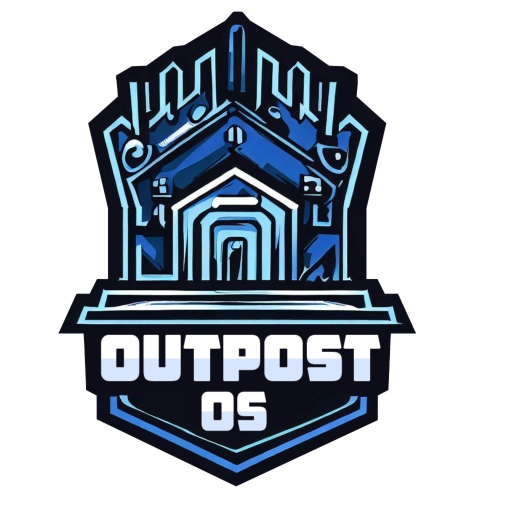

The Outpost Project is a versatile, yet highly secured operating system (RTOS) supporting embedded hardware architectures.

The Outpost operating system is based on the micro-kernel and micro-service paradigm in order to delivers efficient yet small and performant environment in order to build constrained and secured systems such as crypto-enabled devices.
The Outpost operating system is designed in order to enables high performances functions to be executed alongside a Secure Element, including
security considerations from the boot sequence up to the functional service execution.

The Outpost kernel supports ARM Cortex-M in the armv7-m and armv8-m derivatives, and is designed to be easily ported to other platforms such as RISC-V.

## Local repositories

Local repositories naming is using the following rule:

`action-*`: for repositories that hold github actions, used with the usual `uses:` command in github action yaml files
`pipeline-*`: reusable workflows, to be used with various repositories holding the same type of content (e.g. python packages)
`outpost-*`: Outpost OS related tooling. This can be meson, cargo or more generic tooling to be used by various Outpost repositories

When a repository is using (or based on a part of) a given upstream, like, for e.g. `cmsis-core-include`, the repository release must be made after the upstream release used,
with a specific suffix for local releasing and patches, in the way the version field is defined in [the Debian control file description](https://www.debian.org/doc/debian-policy/ch-controlfields.html)

## Community Support

Community support is provided via [Discord](https://discord.gg/939Tjte7);

## Resources

Ressources will be regulary uploaded while open-sourcing the Outpost operating system. In the meanwhile, the following are accessible:

   * [SSTIC 2024 conference paper](https://www.sstic.org/2024/presentation/once_upon_a_time_in_iot_an_industry-grade_os_perspective_for_iot_security/)
